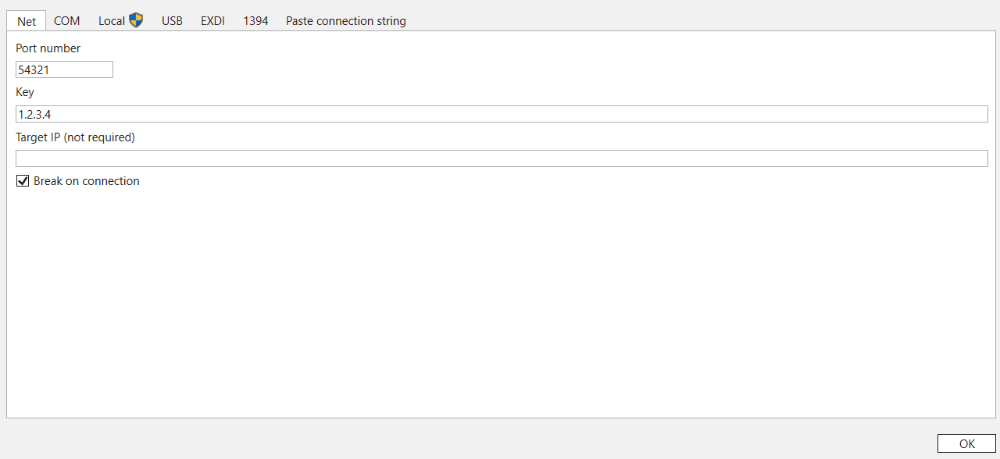
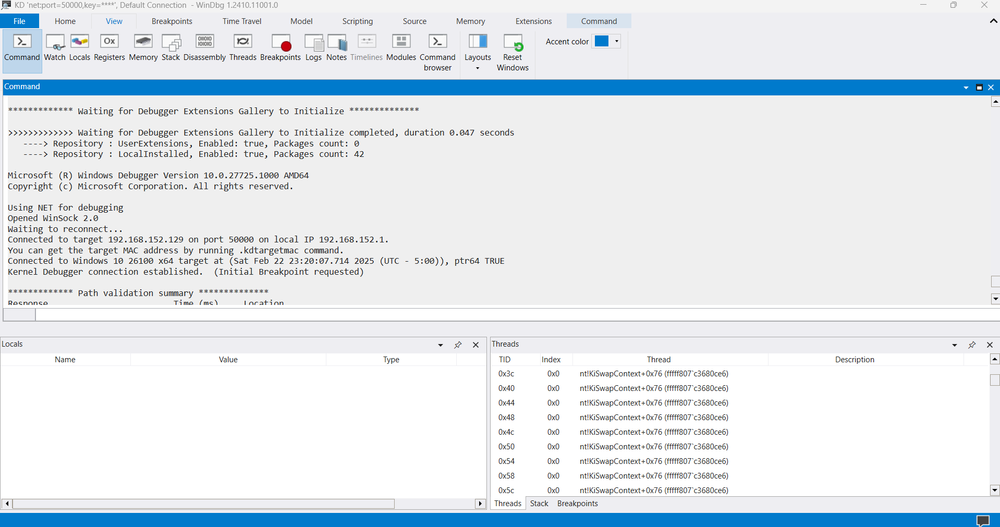

# `rikki`
* [Environment Setup](#environment-setup)
  * [Installing Software Needed on the Host Machine](#installing-software-needed-on-the-host-machine)
  * [Configuring the Test Machine](#configuring-the-test-machine)
  * [Configuring Windbg on the Host Machine](#configuring-windbg-on-the-host-machine)
* [Development Workflow](#development-workflow)
  * [Compiling Your Kernel-Mode Driver](#compiling-your-kernel-mode-driver)
  * [Installing Your Kernel-Mode Driver](#installing-your-kernel-mode-driver)

## Environment Setup
The following instructions describe how to setup your environment. Your environment will consist of a host machine and a test machine. 

### Installing Software Needed on the Host Machine
Follow the instructions below on your host machine.

**Step 1.** Install VMWare Workstation Pro and create a Windows 11 virtual machine. This virtual machine will be your "test machine."

**Step 2.** Install Visual Studio.

**Step 3.** Install the [Windows Driver Kit (WDK)](https://go.microsoft.com/fwlink/?linkid=2297653).

**Step 4.** Install Windbg by opening `cmd.exe` and entering the command below.
```bash
winget install Microsoft.WinDbg
```

### Configuring the Test Machine
**Step 1.** Open the `cmd.exe` as an administrator. 

**Step 2.** Enter the command below to enable debugging on the test machine.
```bash
bcdedit /debug on
```

**Step 2.** Enter the command below to configure the test machine's debug settings. Replace `192.168.152.1` with the actual IP address of your host machine. 
```bash
bcdedit /dbgsettings net hostip:192.168.152.1 port:54321 key:1.2.3.4
```

**Step 3.** Enter the command below to reboot the test machine.
```bash
shutdown /r /t 000
```

**Step 4.** Disable "Driver Signature Enforcement." One way of doing this is describe below.
* Search for and open "change advanced startup options." You should end-up in Settings under System > Recovery > Recovery options.
* Click "Restart now."
* Upon restart, click "Troubleshoot" and then "Advanced options."
* Click "Startup Settings" and then "Restart"
* Enter "7" to "disable driver signature enforcement"

**Step 5.** Pause your test machine and then create a snapshot of it. I personally recommend adding the notes below to the description for reference.
```
* VMware Tools is installed
* Debugging is enabled
* Driver signature enforcement is disabled
```

**Step 6.** Unpause your test machine.

### Configuring Windbg on the Host Machine
**Step 1.** Open Windbg. 

**Step 2.** Click "File > Attach to kernel."

**Step 3.** Your test machine is already configured to send kernel debugging data to your host machine. Now, it's just a matter of configuring your host machine. Configure the "Net" tab to look like below. These settings will create a listener on UDP port 54321 to recieve connections from your test machine. 


**Step 4.** Wait a few seconds and your Windbg window should look like below. If it does not, click the "Command" button. For troubleshooting, (1) make sure your host machine is actually listening on UDP port 54321, (2) make sure you can send traffic from the test machine to your host machine, and (3) check if your test machine is still configured to send kernel debugging data to the right IP address.


## Development Workflow
### Compiling Your Kernel-Mode Driver
Follow the instructions below on your host machine to compile your kernel-mode driver.

**Step 1.** Write or edit the source code of your kernel-mode driver. There is an example in this repository called [`rikki.c`](/rikki.c).

**Step 2.** Open your `Visual Studio Developer Command Prompt`.

**Step 3.** Run the provided build batch file.
```powershell
build.bat
```

### Installing Your Kernel-Mode Driver
Follow the instructions below on your test machine to install your kernel-mode driver.

**Step 1.** Copy your kernel-mode driver (the file ending in `.sys`) to `C:\`.

**Step 2.** Open the `cmd.exe` as an administrator. 

**Step 3.** Create a service entry for your kernel-mode driver.
```bash
sc create rikki type= kernel binPath= "C:\rikki.sys"
```

**Step 4.** Load your driver into the kernel.
```bash
sc start rikki
```

**Step 4.** Check the status of your kernel-mode driver.
```bash
sc query rikki
```

**Step 5.** To see your debug print statements, enter the command below in Windbg's command tab.
```bash
!dbgprint
```

## References
* [Microsoft: Download the WDK](https://learn.microsoft.com/en-us/windows-hardware/drivers/download-the-wdk)
